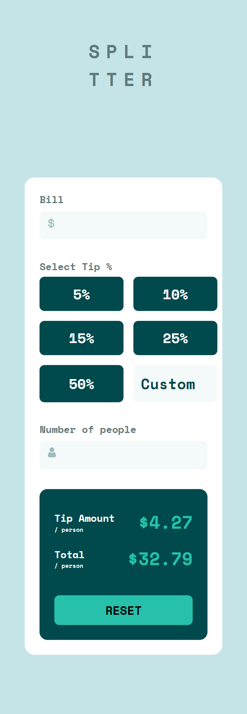
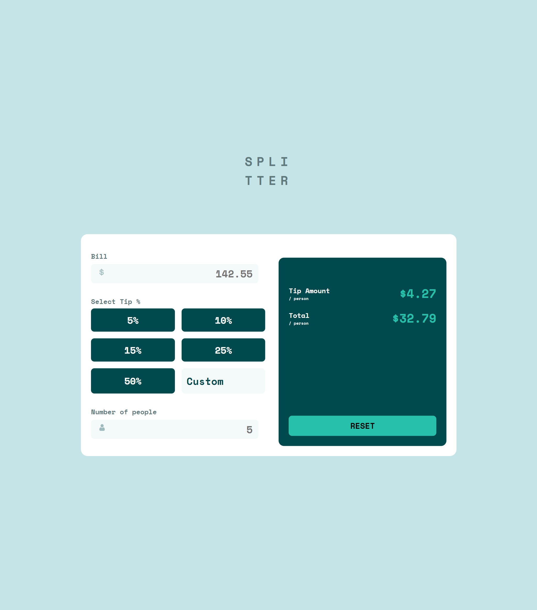

# Frontend Mentor - Tip calculator app solution

This is a solution to the [Tip calculator app challenge on Frontend Mentor](https://www.frontendmentor.io/challenges/tip-calculator-app-ugJNGbJUX). Frontend Mentor challenges help you improve your coding skills by building realistic projects.

## Table of contents

- [Overview](#overview)
  - [The challenge](#the-challenge)
  - [Screenshot](#screenshot)
  - [Links](#links)
- [My process](#my-process)
  - [Built with](#built-with)
  - [What I learned](#what-i-learned)
  - [Continued development](#continued-development)
  - [Useful resources](#useful-resources)
- [Author](#author)

## Overview

### The challenge

Users should be able to:

- View the optimal layout for the app depending on their device's screen size
- See hover states for all interactive elements on the page
- Calculate the correct tip and total cost of the bill per person

### Screenshot

### Links

- Solution URL: [https://github.com/AmanGupta1703/tip-calculator-app-main]
- Live Site URL: [https://tip-calculator-frontend-project-app.netlify.app/]

## My process

### Built with

- Semantic HTML5 markup
- Flexbox
- CSS Grid
- Mobile-first workflow

### What I learned

- In this project, I was able to gain a deeper understanding of front-end web development and its various components. One key concept that I learned about was the input change event, which is an essential feature for creating dynamic and interactive web pages. This event allows for real-time updates based on user input, giving web developers the ability to create highly responsive applications.

- Another important concept that I learned was the `data-[user-specified name]` attribute. This attribute provides front-end developers with an effective way to store custom data within HTML elements. This can be especially useful when working with large and complex datasets, as it allows for more flexible and efficient data management.

- Finally, I was introduced to object-oriented programming (OOP) and its relevance to web development. OOP is a programming paradigm that focuses on creating objects that have properties and methods, and it is a key foundation for many modern web development frameworks. Gaining a basic understanding of OOP was a significant step in my journey to becoming a skilled front-end developer.

- Overall, this project was an invaluable introduction to several key concepts in front-end web development. By learning about the input change event, the `data-[user-specified name]` attribute, and OOP, I now have a stronger foundation for building engaging and dynamic web applications.

### Continued development

- As a developer, I have come to recognize the importance of object-oriented programming (OOP) in software development. I want to focus more on this programming paradigm and apply it to more of my projects. I believe that OOP can help me write more organized, maintainable, and scalable code.

- Furthermore, I am interested in deepening my understanding of input events and how they function. I want to learn more about event listeners, event propagation, and event handling in JavaScript. I think that a solid understanding of input events can help me create more interactive and user-friendly web applications.

### Useful resources

- [MDN - Change Event](https://developer.mozilla.org/en-US/docs/Web/API/HTMLElement/change_eventm) - I found the resource to be particularly helpful in my understanding of the change event, especially as someone who is new to web development. This resource provided a comprehensive overview of the change event and explained it in a beginner-friendly way. It covered the basics of how the change event works and how it can be used in various scenarios. Overall, I would highly recommend this resource to anyone who is looking to learn more about the change event or web development in general

## Author

- Website - [Tip Calculator App](https://tip-calculator-frontend-project-app.netlify.app/)
- Frontend Mentor - [@AmanGupta1703](https://www.frontendmentor.io/profile/AmanGupta1703)
- Twitter - [@thekunalgupta17](https://twitter.com/thekunalgupta17)